## Wireless (redes sem fio)

- Objetivo: Compreender o fenômeno físico envolvido na transmissão de sinais via ondas eletromagné-
ticas e os principais aspectos dos protocolos IEEE 802.11 envolvidos na criação e operação das
redes de dados sem fio.

## Conteúdos

- Motivação
- Propagação de ondas eletromagnéticas
- IEEE 802.11 e seus modos de operação
- Serviços das estações WiFi
- Segurança de dados em WiFi
- Regulmentação no uso do Espectro Eletromagnético
- Características dos canais de rede em 2.4 e 5 GHz
- Atividade: medição de sinais de rede

## Introdução (redes)

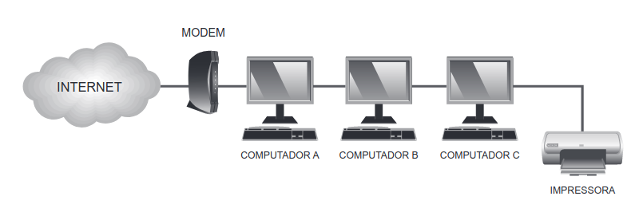

## Introdução (redes)

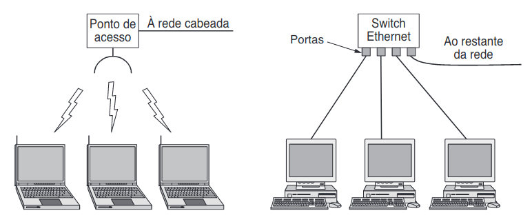

- Com ou sem fios?

<!---

--->

## Meio físico sem fio

- As redes sem fio utilizam a transmissão e recpção de ondas eletromagnéticas.
- Estas ondas podem operar em diferentes frequências.
- Existem frequencias específicas para cada serviço permitido, como TV, rádio, telefonia, etc.

## Propagação de ondas

--------

--------

## Ondas

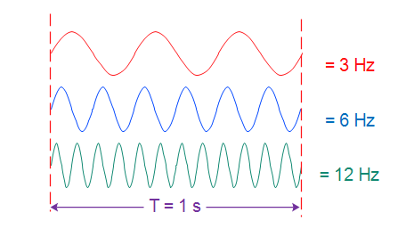

## Ondas eletromagnéticas

## Ondas eletromagnéticas

## IEEE 802.11 / WiFi

- Existem várias tecnologias para redes sem-fio
- A família de padrões IEEE 802.11 é destaque

- Equipamentos em plena adequação aos padrões podem receber uma certificação da Wi-Fi Alliance
- Na prática, WiFi é sinônimo para as redes LAN sem fio neste padrão

## Terminologia

De agora em diante, exceto onde indicado, usaremos redes LAN IEEE 802.11 e WiFi como sinônimos.

## Gerações

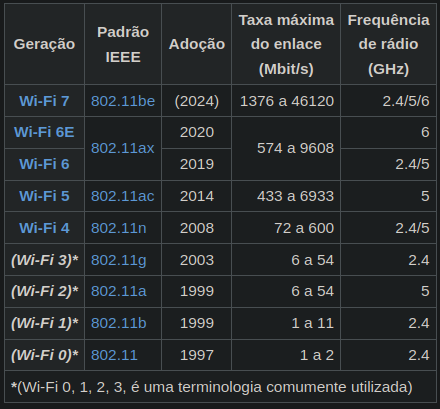

## Pilha de camadas

## WiFi na pilha de camadas

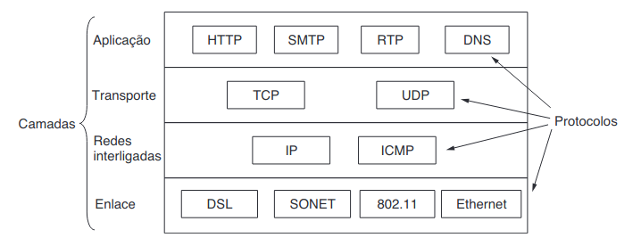

## Modos de operação em Wi-Fi

- Pequeno número de computadores comunicando-se sem fio, sem um equipaento ponto de acesso.

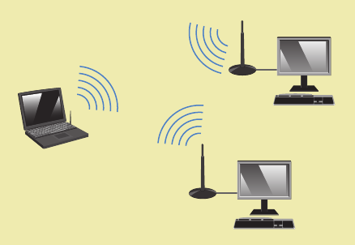

## Modos de operação em Wi-Fi

A rede sem fio é comandada por um periférico chamado ponto de acesso.

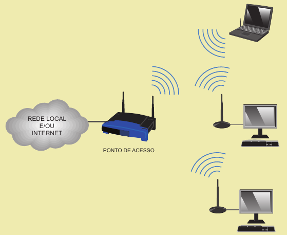

## BSS Basic service set

- A rede recebe um SSID (Serice Set ID) que consiste em um nome configurado pelo administrador.

## ESS Extended service set

- Usados vários pontos de acesso formando uma rede maior com o mesmo SSID.

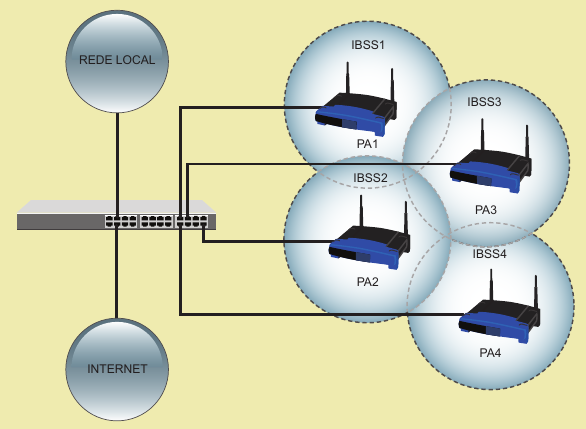

## ESS Extended service set

- Metém-se a sua conectividade com a rede quando está em trânsito.

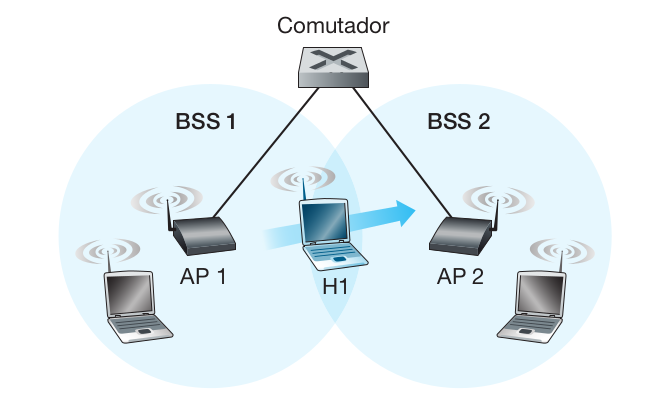

## Serviços de Estação

- Autenticação
- Desautenticação
- Entrega de dados
- Confidencialidade

## Criptografia

|Protocolo                        | Observação                                                             |
|---------------------------------|------------------------------------------------------------------------|
| WEP (Wired Equivalent Privacy)  | não deve ser usado, pois é um protocolo cuja segurança já foi quebrada |
| WPA (Wi-Fi Protected Access)    | não deve ser usado, pois é um protocolo cuja segurança já foi quebrada |
| WPA2 (Wi-Fi Protected Access 2) | só deve ser usado caso o ponto de acesso e as estações não tenham WPA3 |
| WPA3 (Wi-Fi Protected Access 3) | é o algoritmo mais forte no momento e que deve ser utilizado           |

## Uso do Espectro Eletromagnético

- Redes Wi-Fi operam transmitindo ondas de rádio
- O uso do espectro eletromagnétco é regulado em cada país
- Feito pela Anatel no Brasil e a FCC nos EUA.

## Uso do Espectro Eletromagnético

Existem faixas denominadas ISM (Industrial, Scientific, and Medical) que podem ser usadas livremente sem a necessidade de autorização prévia por parte da agência reguladora.

Destas, duas podem ser utilizadas por redes Wi-Fi: 2,4 GHz e 5 GHz.

## Faixa de 2,4 GHz

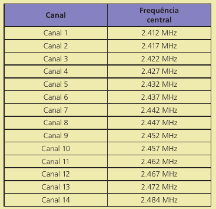

## Faixa de 2,4 GHz

## Características da Faixa de 2,4 GHz

- Saturada
- Sobreposição de canais
- Poucos canais disponíveis
- Muitas redes usando
- Menor desempenho
- Maior alcance
- Mais barata
- Disponível em todos os equipamentos Wi-Fi

## Faixa de 5 GHz

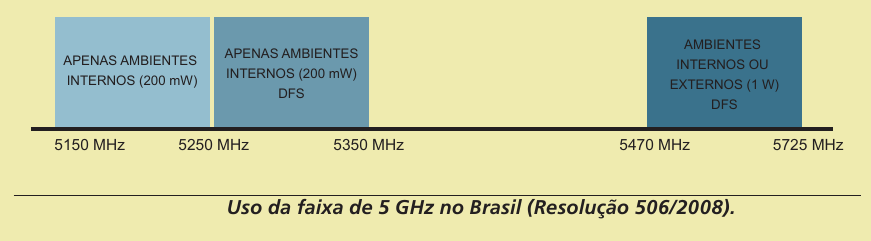

## Características da Faixa de 5 GHz

- Mais “vazia” 
- Canais individuais 
- Mais canais disponíveis 
- Menos redes usando 
- Maior desempenho
- Menor alcance 
- Mais cara 
- Disponível apenas em modelos mais caros

## Atividade Prática

Analise do espectro de redes wifi local.

--------------------

--------------------

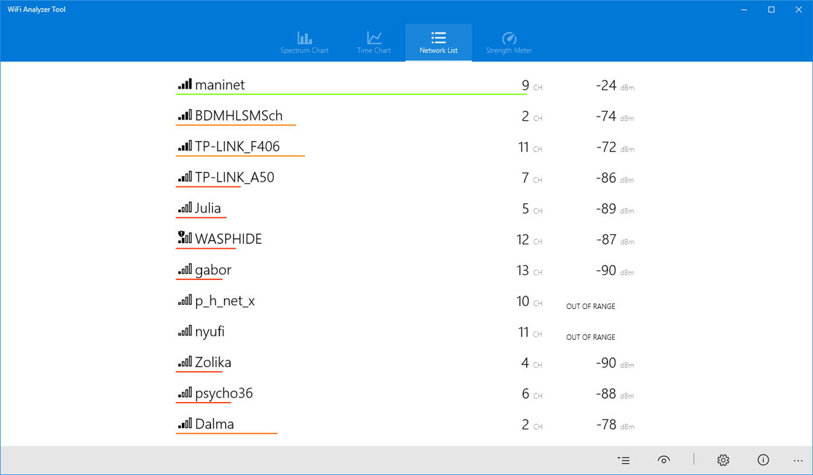

## Exemplo de resultados

Fonte: https://doi.org/10.19053/01211129.v29.n54.2020.10228

## Recap

Lembrando...

## WiFi

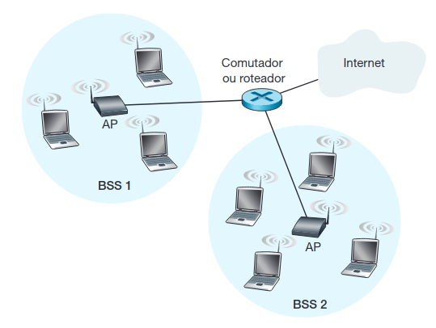

## Referências Bibliográficas

- KUROSE, J. Ross, K. W. Redes de computadores e a Internet. 8ª Ed. Bookman, 2021
- TANENBAUM, A. S. FEAMSTER N. WETHERALL D. Redes de Computadores. 6ª Ed. Bookman. 2021
- TORRES, Gabriel. Redes de computadores. 2ª Edição. Novaterra, 2016

## Bibliografia adicional 

- WHITE, Curt. M. Redes de computadores e comunicação de dados 6ª Edição. Gengage Learning, 2012
- FOROUZAN, B. A., FEGAN S. C. Comunicação de dados e redes de computadores 4ª Edição. Editora AMGH. 2010

# Obrigado!
